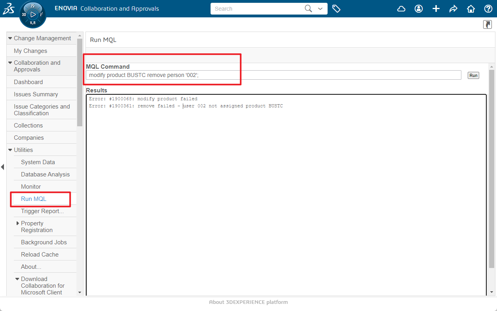

# 移除license


进入服务器，点击桌面的 mql的快捷方式，也可以通过本地电脑用ssh 链接服务器都是可以的；

## 移除所有人 TXO
```batch
set context person creator;
modify product TXO remove person all;
```

```batch
set context person creator;
modify product TXO remove person admin_platform;
```


## 其他参考

```batch
set context person creator;
set context person creator password Qwer1234;

modify product xxx remove person 'xxx';

modify product TXO remove person all;

List person xxx select product;

modify product ADL remove person 'designer1';
modify product BDG remove person 'designer1';
modify product BIM remove person 'designer1';
modify product KPO remove person 'designer1';
modify product KHC remove person 'designer1';
modify product STV remove person 'designer1';
```




